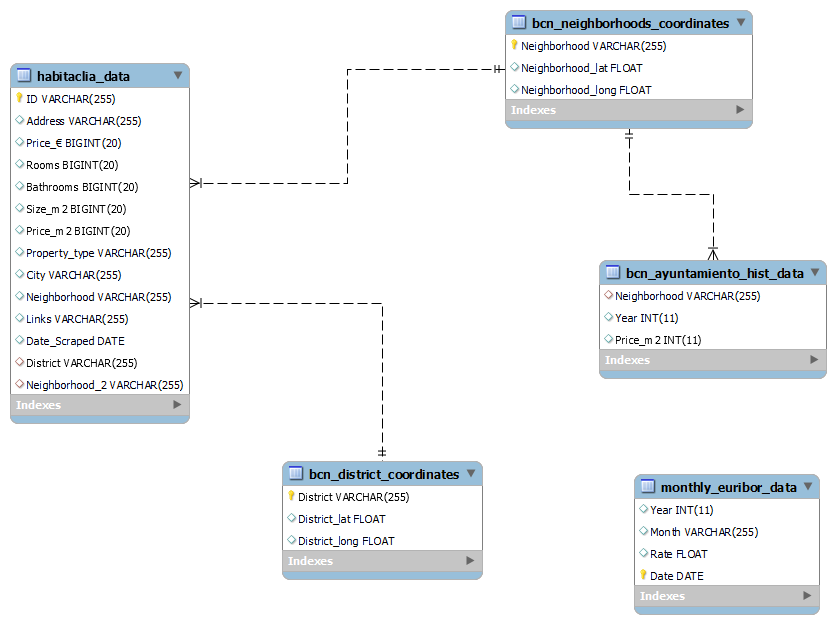
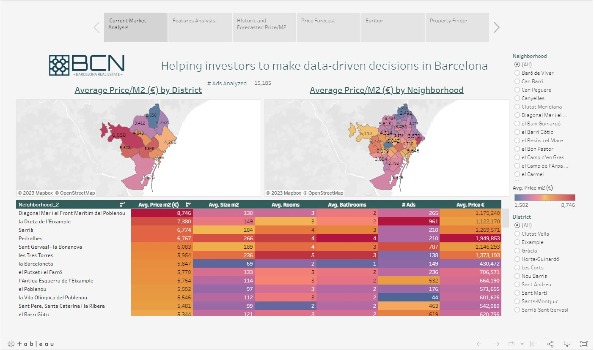
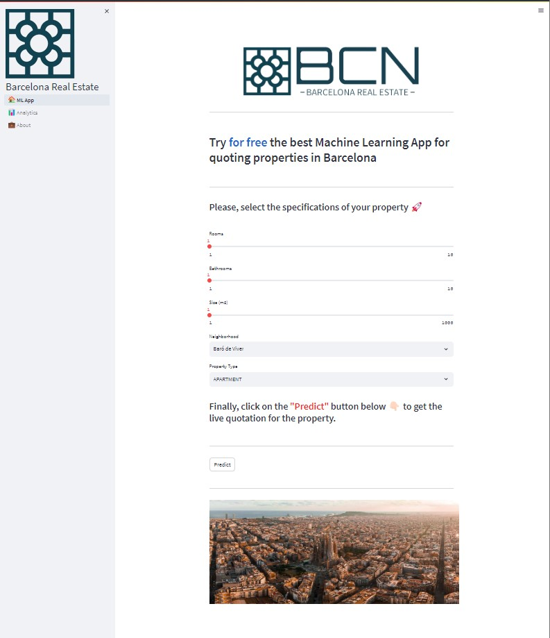

# Project 5 - Final - BCN Real Estate 
---
---

<p align="center">
    
</p>

---
---

In this final project I aimed to integrate all the diferent modules and topics learnt throught the entire bootcamp course of Data Analytics at Ironhack. For that, I have created the brand BCN-Barcelona Real Estate, which is Data Analytics company that leverages big data and machine learning to help investors optimize real estate investments through comprehensive analysis, predictive models, and actionable insights, empowering data-driven decision-making in the dynamic Barcelona market.

This project involved gathering data from multiple sources: scraping a real estate website to analyze current market situations, collecting historical prices/m2 data for each neighborhood in Barcelona from 2012-2022, and obtaining historical Euribor prices from 1999-2022. This data was then used to deploy three machine learning models: an ARIMA regression model for Euribor rate forecasting, a Linear Regression model for precise neighborhood-based m2 price predictions and a Gradient Boosting Regressor model for predictive market analysis. The findings were visualized using a Tableau dashboard, and the integration of all these components were implemented in a Streamlit app, enabling user interaction with the machine learning models and access to the comprehensive dashboard.


---
---
##  Table of Content:
   #### 1. Organization of the repo/project
   #### 2. Overall Process
   #### 3. Data
   #### 4. Machine Learning Models
   #### 5. Visualizations
   #### 6. Streamlit App
   #### 7. Links and Resources

***
### 1. Organization of the repo/project
***
```python
/cartografia
    BarcelonaCiutat_Barris.json
    BarcelonaCiutat_Districtes.json
    barris.geojson
    barris-polygon.shp
    districtes.geojson
    districtes-polygon.shp
/data
    tableau.html
    /scrapes
    /other_files
    /final_data
        BarcelonaCiutat_Barris_coordinates.csv
        BarcelonaCiutat_Districtes_coordinates.csv
        ayuntamiento_scrape_with_BarcelonaCiutat_Barris.csv
        ayuntamiento_scrape_with_BarcelonaCiutat_Barris_melt.csv
        ayuntamiento_scrape_with_BarcelonaCiutat_Barris_melt_mean_for_model.csv
        ayuntamiento_scrape_with_BarcelonaCiutat_Barris_transpose.csv
        habitaclia_bcn_all_data_combined_20230623_with_districts.csv
        idealista_euribor_monthly_until_june_2023.csv
/images
    BCN_from_above.jpeg
    elle-barcelona.jpg
    FltUsL8X0AAJc5H.jpeg
    Logo_2-removebg-preview-ps.png
    Logo_3-removebg-preview-ps.png
    Logo_only.png
    streamlit_app.jpg
    tableau_dashboard_screenshot.jpg
/models
    ayuntamiento_final_model.sav
    ayuntamiento_scrape_with_BarcelonaCiutat_Barris_predicted.csv
    habitaclia_final_model.sav
    idealista_euribor_monthly_predicted.csv
/notebooks
    Habitaclia_data_scrape.ipynb
    Machine_Learning_Models.ipynb
    SQL_upload.ipynb
/pages
    about.py
    dashboard.py
/sql
    bcn_real_state.sql
    bcn_real_state_queries.sql
    SQL_schema.png
/src
    predictions.py
    scrape.py
    sql.py
.gitignore
main.py
README.md
```
***
### 2. Overall Process
***
The execution of this project can be devided into the following stages:

1. Exploratory Data Analysis (EDA) - Pipeline: In this stage, an exploratory data analysis pipeline was created to scrape data from a real estate website, allowing for the gathering of information on properties for sale, such as price and features, in different neighborhoods and districts of Barcelona.

2. SQL Data Storage:
To ensure efficient data management, an SQL database was utilized to store the collected data, including information on the current real estate market situation, historical prices/m2 of each neighborhood in Barcelona from 2012-2022, and historical Euribor prices from 1999-2022.

3. Predictive Modeling: Three machine learning models were used during this project:
    - Time Series Forecasting: An ARIMA regression model with an impressive accuracy of 0.828 was implemented to predict the Euribor Rate for the next 12 months, providing insights into interest rate trends.
    - Precise Price Predictions: A Linear Regression model achieved an r2 value of 0.9339 and an RMSE error of €361.363 per m2, enabling accurate predictions of m2 prices on a neighborhood basis for the next three years.
    - Predictive Market Analysis: A Gradient Boosting Regressor model with an r2 score of 0.6780 and an RMSE error of €961.460 per m2 was utilized to forecast price/m2 based on the current market price and relevant neighborhood features.

4. Dashboard Creation and Data Visualization:
A comprehensive dashboard was developed using Tableau, providing visual representations of the collected data, predictive insights, and historical trends, offering an intuitive and interactive way to explore the information gathered throughout the project.

5. App Deployment:
To make the findings and predictions easily accessible, an app was created using Streamlit. The app allows users to interact with the machine learning models, providing inputs to determine the current market price of m2 for each neighborhood. Additionally, users can directly access the dashboard to visualize the gathered information.
***
### 3. Data
***
During this project, I have gathered data from different data sources:
1. Idealista: This website has been used to scrape information about the historical euribor rate from 1999 to 2022.
2. Ayuntamiento de Barcelona: This website has been used as main source of infomraiton about the different neightborhoods and districts in Barcelona to obtain geojasons and coordinates as well as historical prices/m2.
3. Habitaclia: This website has been scraped to obtain current market value for properties for sale in Barcelona.

During the process the data scraped has been stored in csv files but also unloaded into SQL through Python into MySQL Workbench.
Below you can find the data schema stored into bcn_real_estate scheme:



***
### 4. Machine Learning Models
***
In this project, I have deployed 3 different Machine Learning Models, mainly using the Sklearn library in Python:
1. Time Series Forecasting: I have utilize an ARIMA regression model with an impressive accuracy of 0.828. This model is specifically designed to predict the Euribor Rate for the next 12 months, providing valuable insights into interest rate trends.
2. Precise Price Predictions: The Linear Regression model is employed to predict m2 prices on a neighborhood basis. With an exceptional r2 value of 0.9339 and an RMSE error of only €361.363 per m2, this model ensures accurate predictions for the next three years (current year plus two).
3. Predictive Market Analysis: The Gradient Boosting Regressor model is used to forecast price/m2 based on the current market price and relevant features in a given neighborhood. With an r2 score of 0.6780 and an RMSE error of €961.460 per m2, this model provides valuable insights into potential price fluctuations.

***
### 5. Visualizations
***
The dashboard created with Tableau alows users to analyze the information about the current market situation in Barcelona as well as some predictions based on the machine learning models deplyed throughout the project.



[Click here to view Tableau Public visualization](https://public.tableau.com/app/profile/mariano.ciarrocca/viz/Final_Project_Ironhack_BCN_Real_Estate_Analytics_2023/BCN_Story)


***
### 6. Streamlit App
***
In the last stage of the project, a Streamlit app has been created to allow users to interact with all the findings and predictions easily. This app has 3 different sections, the main page, the user can find the machine learning model that allows inputs from different features to provide a prediction of the price/m2 for the neightborhood selected.Additionally, users can directly access the dashboard to visualize the gathered information. Finally, there is a section about the company and the developer of the app and all the analysis made in the project.



***
### 6. Links and Resources
***
- Data sources: 
1. Brazilian E-Commerce Public Dataset by Olist (Kaggle): https://www.kaggle.com/datasets/olistbr/brazilian-ecommerce


- Other useful links:
    - https://powerbi.microsoft.com/es-es/desktop/
    - https://www.kaggle.com/